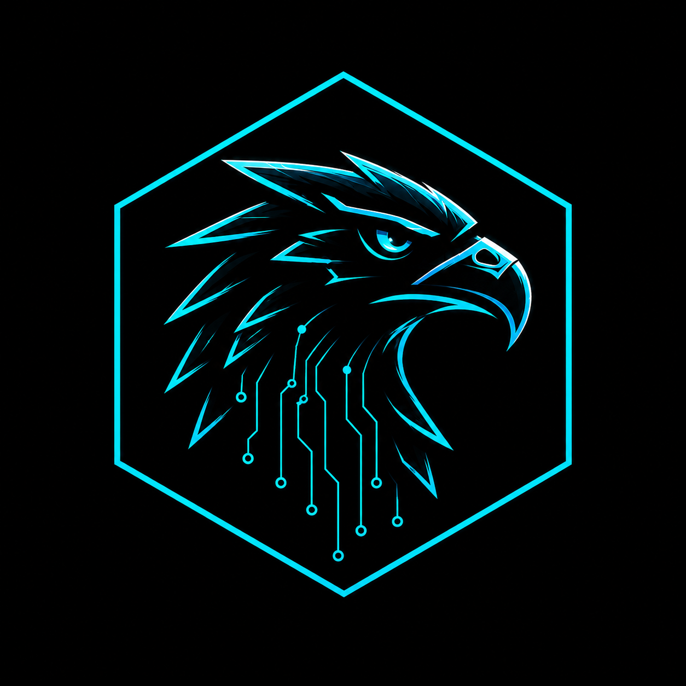

clea<div align="center">



# TERMINAL 404

### Engenharia Digital para Web, Software e Negócios

**Back-end • Front-end • Banco de Dados • Sites • Aplicativos • Sistemas • Soluções para Empresas**

<br>


</div>

---

## Sobre a Terminal 404

A **Terminal 404** é uma empresa de tecnologia e desenvolvimento de software voltada à criação de soluções digitais sob medida para empresas, profissionais e projetos em crescimento.

Atuamos da concepção à operação da solução: planejamento, arquitetura, desenvolvimento, integração, banco de dados, publicação, manutenção e evolução contínua.

Nosso objetivo é transformar necessidades de negócio em **produtos digitais funcionais, seguros, escaláveis e sustentáveis tecnicamente**.

---

## O que desenvolvemos

| Área | Soluções |
|---|---|
| **Front-end** | Interfaces web, landing pages, sites institucionais, dashboards e aplicações responsivas |
| **Back-end** | APIs, serviços, regras de negócio, autenticação, integrações e sistemas distribuídos |
| **Banco de Dados** | Modelagem, relacionamentos, migrations, consultas, integridade e organização de dados |
| **Sites** | Sites institucionais, páginas comerciais, sistemas administrativos e experiências digitais personalizadas |
| **Aplicativos** | Aplicações e produtos digitais orientados às necessidades do projeto e do negócio |
| **Sistemas Empresariais** | Ferramentas internas, automações, painéis, fluxos operacionais e sistemas sob medida |
| **Infraestrutura** | Deploy, servidores Linux, serviços, HTTPS, monitoramento e organização de ambientes |
| **Projetos de Negócio** | Soluções digitais planejadas de acordo com objetivos, processos e necessidades específicas da empresa |

---

## Engenharia de Software

Na Terminal 404, desenvolvimento não significa apenas escrever código.

Cada projeto é tratado como uma solução completa, considerando:

```text
NEGÓCIO
   ↓
LEVANTAMENTO DE NECESSIDADES
   ↓
ARQUITETURA E PLANEJAMENTO
   ↓
UX / INTERFACE / FLUXOS
   ↓
FRONT-END + BACK-END
   ↓
BANCO DE DADOS + INTEGRAÇÕES
   ↓
TESTES E VALIDAÇÃO
   ↓
DEPLOY E INFRAESTRUTURA
   ↓
MONITORAMENTO
   ↓
MANUTENÇÃO E EVOLUÇÃO
```

A tecnologia deve servir ao negócio — e não o contrário.

---

## Tecnologia

Nossa stack é definida de acordo com o problema, os requisitos do projeto e a necessidade de manutenção futura.

### Web & Front-end


### Back-end & Sistemas


### Dados


### Infraestrutura & Operação


> A lista acima representa tecnologias utilizadas ou consideradas conforme o contexto de cada projeto. A arquitetura final é definida individualmente.

---

## Desenvolvimento orientado a negócios

Projetos empresariais precisam resolver problemas reais.

Por isso, buscamos alinhar tecnologia com:

- objetivos operacionais e comerciais;
- experiência do usuário;
- segurança e controle de acesso;
- organização e confiabilidade dos dados;
- desempenho e capacidade de crescimento;
- facilidade de manutenção;
- integração com serviços existentes;
- evolução futura do produto.

O resultado esperado não é apenas um sistema funcionando, mas uma **base tecnológica que acompanhe a evolução do negócio**.

---

## Nossos projetos podem envolver

```text
┌──────────────────────────────────────────────────────────────┐
│                       TERMINAL 404                           │
├──────────────────────────────────────────────────────────────┤
│  Sites                 │  Aplicações Web                    │
│  APIs                  │  Aplicativos                       │
│  Sistemas internos     │  Dashboards                        │
│  Banco de dados        │  Automações                        │
│  Integrações           │  Infraestrutura                    │
│  Monitoramento         │  Segurança operacional             │
│  Manutenção            │  Evolução de produtos             │
└──────────────────────────────────────────────────────────────┘
```

---

## Qualidade e segurança

Trabalhamos para manter os projetos preparados para operação e manutenção de longo prazo.

**Princípios técnicos:**

- código organizado e legível;
- separação adequada entre front-end, back-end e dados;
- controle de versão com Git;
- configuração de ambientes;
- proteção de credenciais e secrets;
- validação de entradas e tratamento de erros;
- documentação técnica;
- testes sempre que aplicáveis ao projeto;
- monitoramento e observabilidade para sistemas que exigem operação contínua.

---

## Estrutura de um projeto Terminal 404

Uma solução pode começar pequena e crescer progressivamente.

```text
FASE 01  →  Descoberta e requisitos
FASE 02  →  Arquitetura e planejamento
FASE 03  →  Design e experiência
FASE 04  →  Desenvolvimento
FASE 05  →  Banco de dados e integrações
FASE 06  →  Testes e validação
FASE 07  →  Deploy e infraestrutura
FASE 08  →  Monitoramento e manutenção
FASE 09  →  Evolução do produto
```

---

## Projetos em destaque

### Kairo

Plataforma de monitoramento de servidores Linux, com coleta de métricas, detecção de eventos, alertas e comunicação segura entre agentes e uma central de gerenciamento.

**Foco:** infraestrutura, observabilidade, segurança operacional, back-end, APIs e banco de dados.

### Soluções Web e Institucionais

Desenvolvimento de sites e aplicações digitais para presença online, comunicação, atendimento, processos internos e necessidades específicas de cada negócio.

---

## Identidade Terminal 404

A identidade visual da Terminal 404 combina **tecnologia, contraste e estética neon** em uma linguagem contemporânea e reconhecível.

| Elemento | Referência |
|---|---|
| **Base** | `#08090C` |
| **Ciano** | `#00E5FF` |
| **Azul** | `#148BFF` |
| **Rosa Neon** | `#FF00AA` |
| **Magenta** | `#FF4FCB` |
| **Estética** | Digital, técnica, neon, minimalista e tecnológica |

---

## Visão

Construir software que seja útil hoje e continue fazendo sentido amanhã.

A Terminal 404 trabalha para aproximar **tecnologia, operação e negócio**, criando produtos digitais que possam ser mantidos, aprimorados e preparados para crescer.

---

## Contato

**Terminal 404**

Desenvolvimento de software, sites, aplicativos e soluções digitais para empresas.

🌐 **terminal404.com.br**

---

<div align="center">

### TERMINAL 404

**Build. Deploy. Evolve.**

</div>
