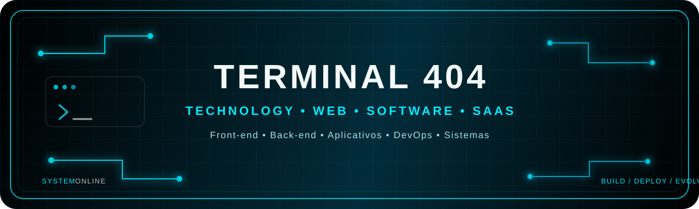

<div align="center">



<br>


<br>

# TERMINAL 404

### Tecnologia para Web, Software e Produtos Digitais

<p>
  
  
  
  
</p>

<p>
  <a href="https://terminal404.com.br">Website</a>
  &nbsp;•&nbsp;
  <a href="https://github.com/Terminal404stack">GitHub</a>
</p>

</div>

---

## ⚡ Quem somos

A **Terminal 404** é uma empresa de tecnologia focada no desenvolvimento de **sites, aplicações web, sistemas, SaaS e aplicativos**.

Construímos soluções digitais de ponta a ponta, conectando **interface, lógica de negócio, dados e infraestrutura** em projetos pensados para uso real e evolução contínua.

> **Da ideia à operação. Da primeira versão à evolução do produto.**

---

## 🚀 O que desenvolvemos

<table>
<tr>
<td width="50%" valign="top">

### 🌐 Front-end

Interfaces modernas, responsivas e orientadas à experiência do usuário.

**Tecnologias**

`HTML` `CSS` `JavaScript`

</td>
<td width="50%" valign="top">

### ⚙️ Back-end

APIs, regras de negócio, integrações, autenticação e serviços.

**Tecnologias**

`PHP` `Java` `Go` `Node.js`

</td>
</tr>

<tr>
<td width="50%" valign="top">

### 🛰️ DevOps & Infraestrutura

Ambientes de desenvolvimento, deploy e operação de aplicações.

**Ferramentas**

`Podman` `Linux` `Git` `GitHub`

</td>
<td width="50%" valign="top">

### 📱 Produtos Digitais

Soluções construídas de acordo com o problema e a necessidade do projeto.

**Atuação**

`Sites` `Sistemas Web` `SaaS` `Aplicativos` `Dashboards` `Automações`

</td>
</tr>
</table>

---

## 🧩 Stack tecnológica

### Front-end

<p>


</p>

### Back-end

<p>


</p>

### DevOps & Ferramentas

<p>


</p>

---

## 🛠️ Como trabalhamos

<div align="center">

```text
┌───────────────────────────────────────────────────────────────┐
│                         TERMINAL 404                          │
├───────────────────────────────────────────────────────────────┤
│                                                               │
│   IDEIA → REQUISITOS → ARQUITETURA → DESENVOLVIMENTO         │
│                                      ↓                        │
│                       TESTES → DEPLOY → OPERAÇÃO              │
│                                      ↓                        │
│                         MONITORAMENTO → EVOLUÇÃO              │
│                                                               │
└───────────────────────────────────────────────────────────────┘
```

</div>

A escolha da tecnologia depende do **problema, requisitos, contexto e manutenção do projeto**. PHP, Java, Go e Node.js podem ser utilizados conforme a necessidade do produto ou sistema.

---

## 💼 Engenharia orientada a negócios

Projetos empresariais precisam resolver problemas reais.

Buscamos alinhar tecnologia com:

`Objetivos` • `Experiência` • `Segurança` • `Dados` • `Desempenho` • `Manutenção` • `Integrações` • `Evolução`

O resultado esperado é uma **base tecnológica preparada para acompanhar o crescimento do produto e do negócio**.

---

## 📡 Projetos

### Kairo

Projeto voltado ao **monitoramento de servidores**, com coleta de métricas, comunicação entre agentes e central, detecção de eventos e alertas operacionais.

**Foco:** infraestrutura, observabilidade, segurança operacional, back-end, APIs e banco de dados.

### Soluções Web e Institucionais

Desenvolvimento de sites e aplicações digitais para presença online, comunicação, atendimento, processos internos e necessidades específicas de cada negócio.

---

## 🛡️ Qualidade & segurança

**Código claro.**  
**Arquitetura coerente.**  
**Segurança desde o desenvolvimento.**  
**Infraestrutura organizada.**  
**Projetos preparados para evolução.**

---

## 🎨 Identidade Terminal 404

A identidade da Terminal 404 combina **fundo preto, contraste elevado e ciano neon** em uma linguagem técnica e contemporânea.

| Elemento | Cor |
|---|---|
| 🖤 Fundo | `#000000` |
| 🔵 Ciano Neon | `#03E9FB` |
| 🔷 Ciano Principal | `#04CEF1` |
| 🌊 Ciano Médio | `#02A6C5` |
| 🔹 Ciano Escuro | `#027A90` |
| 🌑 Azul Tecnológico | `#022C3A` |
| ⚪ Branco | `#F4FAFA` |
| 🩶 Prata Claro | `#AAE1E7` |

---

<details>
<summary><strong>📌 Estrutura de um projeto Terminal 404</strong></summary>

<br>

```text
FASE 01 → Descoberta e requisitos
FASE 02 → Arquitetura e planejamento
FASE 03 → Design e experiência
FASE 04 → Desenvolvimento
FASE 05 → Banco de dados e integrações
FASE 06 → Testes e validação
FASE 07 → Deploy e infraestrutura
FASE 08 → Monitoramento e manutenção
FASE 09 → Evolução do produto
```

</details>

---

<div align="center">

### TERMINAL 404

**Build. Deploy. Evolve.**

<sub>Desenvolvimento de software, sites, aplicativos e soluções digitais para empresas.</sub>

<br>

🌐 **[terminal404.com.br](https://terminal404.com.br)**

</div>
